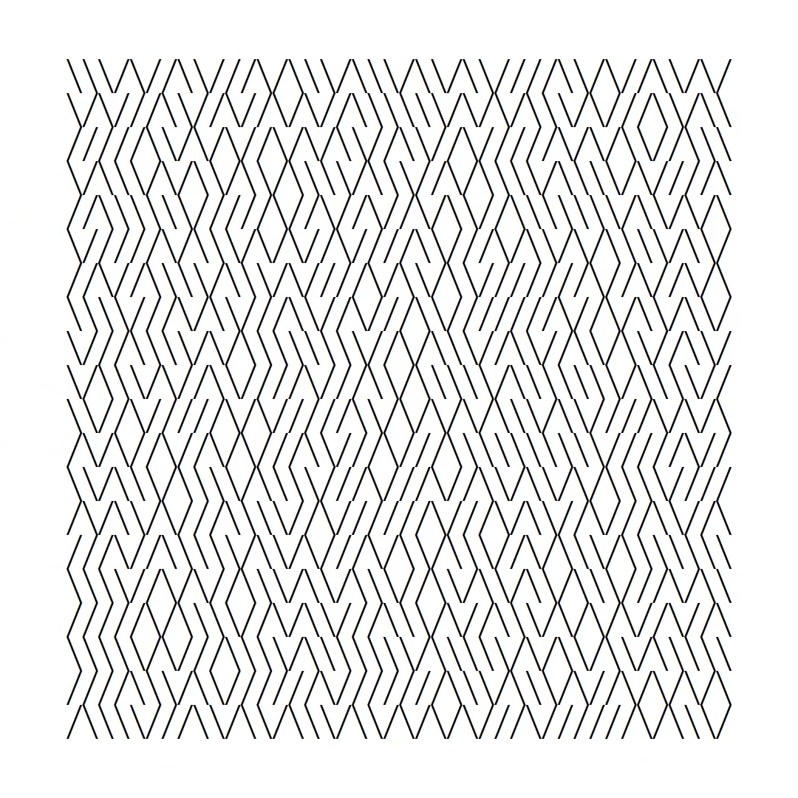
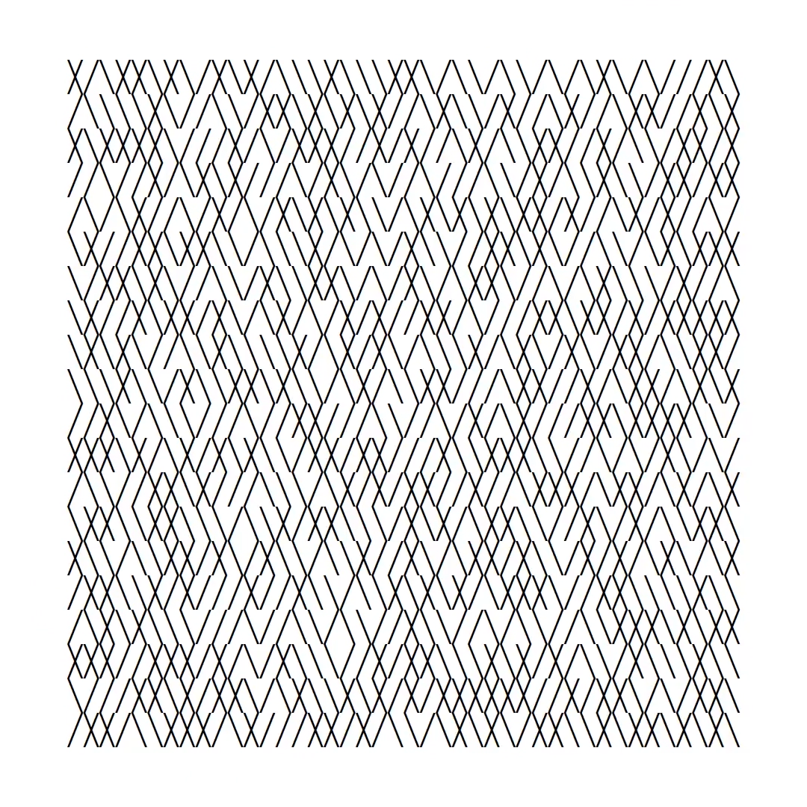
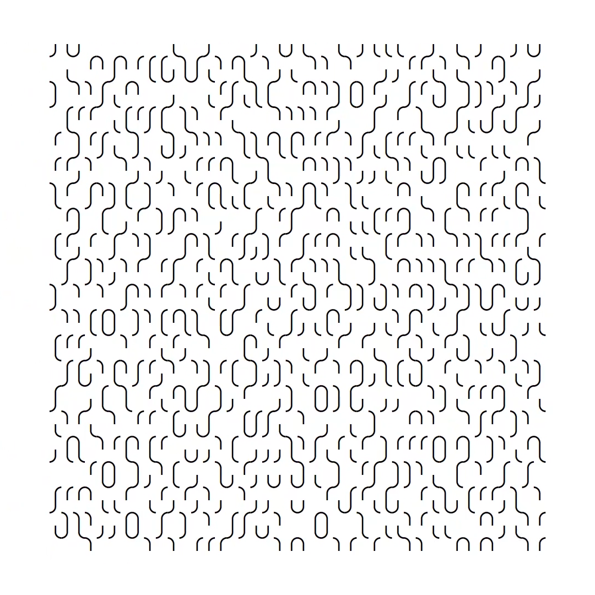

# UNICODE PRINT

*[createdby.fi](http://createdby.fi)*

Unicode generative art inspired by `10 PRINT CHR$(205.5+RND(1)); : GOTO 10`, a one line program for Commodore 64 Basic.

The [10 PRINT book](https://10print.org/) and [Dan Shiffman's Video]() on the subject were helpful when working on this project.

